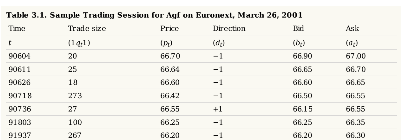
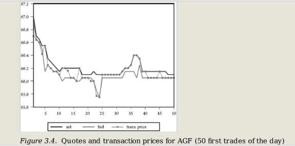
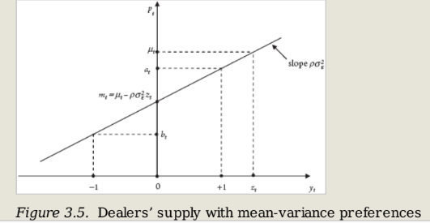
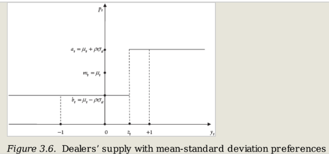
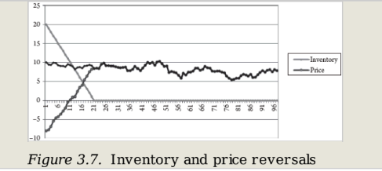
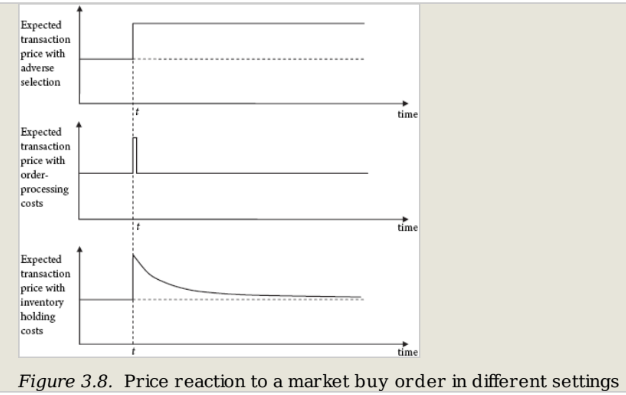
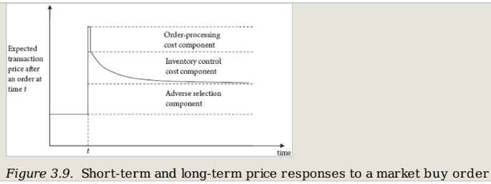

# [ML] Chapter 3. Order Flow, Liquidity, and Securities Price Dynamics

# 3.0 Abstract

- 일(Daily) 중 주가 변동을 어떻게 이해할 수 있을까?
- 주가 변동을 이해하는 프레임워크를 통해, 주문 흐름, 호가 스프레드 등의 변수를 이해할 수 있음
- 본 챕터에선 가격 역동성, 효율적 시장가설 및 정보에 기반한 주문 흐름 등을 다루며, 주가 변동에 대해 이해하고자 함

# 3.1 Introduction

- 자산가격은 원칙적으로 **<u>펀더멘탈 뉴스에 의해 변하지만</u>**, 극히 짧은 시간에는 관련 뉴스가 없어도 지속적으로 변동함.
- 시장 미시구조는 **<u>하루 내의 가격 움직임의 원인 중 하나를 유동성</u>** 으로 봄.
- 주문의 근본적인 동기나 시장 참가자들의 해석 방식이 펀더멘탈 뉴스를 반영하면 가격 움직임이 오래 지속되고, 아니면 빠르게 해소

- 표 3.1 프랑스 보험사 AGF의 거래 데이터를 보면, 거래 시간, 절대 크기, 실행되는 가격, 입찰 견적 및 최저 견적, 거래 방향(거래 개시 당사자가 구매자면 1, 판매자면 -1) 등을 볼 수 있음
- **<u>거래 패턴이 특정 주식이나 기간에 특징적이지 않은데, 어떻게 Intraday 거래를 이해할 수 있을까?</u>** (CH 3.1)
- 본 챕터에선 주가 변동을 이해하는 틀을 통해, 특히 주문 흐름과 호가 스프레드를 결정하는 요인들을 설명하고자 함 (이를 통해 가격 변동성, 스프레드, 주문 흐름이 어떻게 서로 연관되어 있는지 밝힐 수 있음)  

- 이 모든 논리 전개는 **<u>효율적 시장 가설(EMH)에서 출발</u>** 하여, 랜덤워크를 따르던 주가가 새로운 정보에 의해 변함. (CH 3.2)
- EMH가 bid ask quote, orderflow 등 가격 변수들에 명확한 역할을 주진 않지만, 이런 변수들에 의해 실제 가격이 바뀜
- 가령 마켓이 완전 유동적이지 못하면, 주문량이 많으면 가격 움직임과 변동성이 훨씬 커짐.  

- 이런 패턴들을 주문 흐름 자체가 새로운 정보를 제공할 수 있다는 가정으로 EMH와 엮을 수 있음.
- 가령, 지나친 매수 주문은 가격의 과소평가, 매도 주문은 과대평가 시그널로 생각해서 주식의 기대치를 수정할 수 있음.
- 위의 직관들을 공식화하기 위해, 호가 스프레드에 대해 설명하고, 가격 변화를 주문 흐름과 연관시킴 (CH 3.3)
- (위의 모형에선) **<u>정보가 많은 사람과의 거래를 통해 유동성 공급자는 손해를 보게 되고, 이를 호가 스프레드를 통해 보상받고자 함. 때문에, 정보 비대칭성이 유동성 정도를 결정함.</u>**   

- 현실에선 **<u>유동성 공급자는 주문을 실행하고, 주문 처리 비용을 충당해야 하는데, 이런 요소들도 유동성에 영향을 미침</u>**
- 또한 불완전 경쟁(독과점)으로 인해 유동성 공급자들이 이익을 거두는데, 이런 것들을 모델에 반영하고자 함(CH 3.4)   

- **<u>호가 스프레드가 존재하는 또 다른 이유는 딜러들이 위험 회피적이기 때문,</u>** 
- 거래일 동안 가격 변동으로 인해 유동성 공급자들은 포지션의 가치변동(재고 위험)에 노출되기 때문에, 큰 호가 스프레드가 필요함.
- 재고 위험과 딜러의 위험 회피가 호가에 미치는 영향을 분석하고, 유동성 공급자가 갖는 아래 세 가지 비용에 대해 설명하고 있음 (CH 3.5)
    - 더 나은 정보를 가진 투자자와의 거래비용(역선택 비용)
    - 주문처리 비용
    - 위험자산 보유 비용(재고 비용)
  
- **<u>유동성 공급자(이하 LP)가 부담하는 다양한 비용이 시장에 서로 다른 영향을 미치기 때문에 이를 구분하는 것이 중요</u>** 
- 호가 스프레드가 역선택에 대한 보상이라고 하면, 시장 주문이 가격에 미치는 영향이 영원하기 때문에 LP의 주가 예측치를 바꿔야 함.
- 반면 주문처리 비용이나 재고 위험에 대한 보상이라면, 시장 질서 가격 영향이 일시적이기 때문에 시간이 지남에 따라 소멸해야 함
- 실제 관측에 의하면 모든 비용 요소를 고려해야 함
- 실제 유동성은 딜러와 시장 조성자 모두에 의해 공급될 수 있는데, 이 때 누가 유동성을 공급했는지는 중요하지 않음
- 딜러는 주문을 통해 유동성을 소비하는데, t 시점에 i 딜러가 제시한 bid price를 $b_t^i$, ask price를 $a_t^i$라 할 수 있음
- best ask bid price를 다음과 같이 나타낼 수 있음
$$a_t=\bf{min_i(a_t^i)}, b_t=\bf{min_i(b_t^i)}$$
- 즉 투자자는 가장 낮은 가격에 사서 가장 높은 가격으로 판매하고자 하기 때문에, 체결가격은 오직 방향에 따라 결정됨

# 3.2 Price Dynamics and the Efficient Market Hypothesis

- 일부 축구 클럽은 거래소에 상장되어 있는데, 경기 결과에 주가가 민감하게 반응함
- 새로운 정보에 의해 가격이 변하는데, EMH는 가격 조정이 즉각적이어야 한다고 주장

$$ pt=\mu_t ≡ E(v|\Omega_t) $$

- 이 때 $\mu_t$는 $t$ 시점에서 증권가치 $v$에 대한 시장조성자들의 추정치, $\Omega_t$는 그들이 이용할 수 있는 정보, $E(v|\Omega)$는 $v$의 정보에 대한 기대값
- t+1 시점에 새로운 뉴스가 도착하자마자, EMH에 의해 랜덤변수 $\epsilon_{t+1}$가 변하는데, 미래의 임팩트는 과거 시점의 영향을 전혀 받지 않음. 때문에 아래 식처럼 나타낼 수 있음
$$E[\epsilon_{t+1}|\Omega_t]=0 \\  E[\mu_{t+1}|\Omega_t]=\mu_t $$

- $p_t=\mu_t$라 가정하고, EMH에서 가격은 마팅게일을 따르기 때문에 아래 식이 성립
$$p_t=E(p_{t+1}|\Omega_t) \\  \Delta p_{t+1}=p_{t+1}-p_t=\mu_{t+1}-\mu_t=\epsilon_{t+1} $$

- 시장이 정보효율적이기 위해선, 시장 참여자들이 갖는 정보의 성격에 대해 (예를 들어 아래처럼) 구체적으로 정의해야 함
    - 딜러가 위험 중립적이고 경쟁적
    - 투자자가 딜러보다 많은 정보를 가지고 있지 않음 (order flow를 보고 딜러가 주가 추정치를 바꾸지 않음)
    - 거래 비용이 없음을 가정해야 함
- 위의 상황에선 호가 스프레드가 0이 되고, 주문에 의한 가격 변동이 없음
- 위의 가정하에선 딜러가 주식을 팔았을 때 다음의 예상 수익을 얻음
$$ E[(a_t^i-v)|\Omega_t]=a_t^i-\mu_t $$

- 딜러의 수익은 ask의 가장 하단과의 차이지만, 마켓을 경쟁적이기 때문에 결국 ask price는 $\mu_t$로 수렴
- bid price도 마찬가지인데, 떄문에 모든 주문이 $\mu_t$로 수렴하고, 주가는 주문 흐름의 영향을 받지 않음

- 위의 가정들은 꽤나 유용하지만, 인트라데이 거래의 중요한 측면을 포착하지 못함
    - 주간 가격 변동성이 뉴스만으로 설명되기엔 너무 크다는 선행 연구가 있음
    - 양의 스프레드를 갖는게 일반적임을 설명하지 못함
    - 주간 가격 변화가 실제로 왜 종종 음의 상관관계 보이나?
- 나머지 챕터에선 위의 가정들을 완화시키고자 함. 거래가격과 딜러들의 자산 추정치가 동일하지 않은 이유는 무엇일까? 많은 질문들을 앞으로 해결하고자 함

# 3.3. Price Dynamics with Informative Order Flow

- EMH에서 증권의 가격은 새로운 정보에 의해 지속적으로 업데이트 된다는 것을 가정함.
- 새로운 정보는 공개적인 발표에서 발생하지만, 일부 투자자들은 더 빠르게 정보를 얻기 때문에, 누군가의 주문이 이미 공개된 정보 이상의 정보를 시장에 전달하는 효과를 가짐.
- 때문에 시장 참가자들은 주문 흐름을 고려해서 증권의 가치 추정치를 수정하고, 호가 스프레드의 존재가 설명됨.
- 딜러가 항상 모든 정보를 최선으로 알지 못하기 때문에, 거래로 인해 손해를 보는 것을 역선택이라 함 (적정가치 보다 높은 가격에 매수하거나 낮은 가격에 매도)
- 딜러는 때문에 다른 거래자와의 거래를 통해 이득을 얻어야 하고, 이를 Glosten and Milgrom 모델을 통해 설명하고자 함
$$ a_t=E(v|\Omega_{t-1}, d_t=+1) \\ b_t=E(v|\Omega_{t-1}, d_t=-1) $$

- 위의 모델에서 ask price는 매수 주문을 예상하고, bid price는 매도 주문을 예상하기 때문에 ask price가 bid price 보다 큼
- $a_t$는 지난 시점의 정보 $\Omega_{t-1}$과 지난 거래 $d_t$에 대한 기대값으로 나타남

## 3.3.1 The Glosten-Milgrom Model

- v는 펀더멘탈 밸류. 알 수 없는 것에 대해 추정한 것이 mu
- 일부 트레이더가 딜러보다 더 나은 정보를 갖고 있다면, 아래 식으로 나타낼 수 있음

$$
\mu_t=\theta_tv^H+(1-\theta_t)v^L
$$

- (트리 가장) 끝 노드의 가치 v가 theta의 확률을 갖는 이항분포를 따른다고 가정하고, vH나 vL 중 하나로 향함.
- 딜러들은 다른 채널에서 정보를 얻기도 하지만, 주문이 딜러들에게 유일한 정보원이라 가정

$$
\Omega_t=\{d_1,d_2,...d_t\}
$$

- 이 때 입찰과 호가는 조건부로 이루어짐. 때문에 주문 가격은 얼마?라는 질문에는 실제 주문 받기 전과 후가 동일해야 함
- 챕터 3.2의 식을 이용하면 딜러에 의해 세팅되는 ask와 bid 가격은

$$
a_t=\mu_t^+=E(v|\Omega_{t-1},d_t=+1) \\b_t=\mu_t^-=E(v|\Omega_{t-1},d_t=-1)
$$

- $\mu_t^+$는 딜러가 t 시점에 buy order를 받으면 내는 증권의 추정치
- 주문 흐름이 정보를 포함하면, $\mu_t^+\neq \mu_t$를 만족해야 함
- bid와 ask가 vL과 vH 사이에 있기 때문에, 투자자들은 v=vH를 목격하면 사고, 반대면 팔 수 있음
- 매수 주문이 두 가지 방식으로 일어나는데, 1-pi의 확률로 유동성 거래자가 오고, 1/2의 확률로 구매
- 역으로 sell order에서도 성립함
- 이런 관측은 정보에 입각한 거래자들이 좋은(나쁜) 뉴스에 관심이 있을 때 일련의 매수 매도 주문 가능성이 더 높음을 직관적으로 보여줌
- 정보에 입각한 거래는 주문 흐름과 주식 가치 사이 양의 상관관계를 유도

## 3.3.2 The Determinants of the Bid-Ask Spread

- 해당 모델을 통해 호가와 입찰가를 계산하고자 하는데, 위험중립 딜러가 있는 완전시장에선 0의 기대이익을 얻는 시점까지 거래가 발생
- 시장조성자는 1) 정보에 입각한 투자자에게 매각해서 vH의 손실을 보거나, 2) 유동성 거래자에게 판매할 수 있으므로 -mu_t-1의 이익을 예측할 수 있음
- 매수와 매도에서 가능한 이벤트는 표 3.2로 요약됨

- 딜러들이 경쟁력이 있다면 a1은 기대 이익이 0이 될 것임.
- 호가 스프레드는 딜러들이 더 많은 정보를 갖고 있는 투자자들과 거래할 때 발생하는 손실을 충당하기 위한 보상의 성격, 즉 역선택 비용임
- 식 3.12에 의해 정보를 갖고 있는 거래자의 비율 pi와 vH-vL 차이에 의한 증권가치 변동성이 증가함수임을 보여줌

- 결정 요인, 즉 증권의 가치에 대한 딜러들의 믿음은 시간에 따라 달라지는데, 시장 조성자가 가치 추정치를 변경하기 때문
- 딜러들의 공정가치가 vH라 확신하기 때문에 새로운 매수주문은 가치 추정치를 이동시키지 않음
- theta_t-1이 0.5이면, 딜러들은 시장 방향성에 불확실하기 때문에 새로운 주문에 민감하고, 중요 정보가 발표되면 호가 스프레드가 커짐

## 3.3.3 How Do Dealers Revise their Quotes?

- 증권의 기본가치, mu_t-1과 theta_t-1이 주어진 것으로 가정했는데, 호가가 식 3.15에 의해 달라지기 때문에, 시간이 지남에 따라 신규 주문을 고려한 딜러들의 생각이 어떻게 바뀌는지 살펴봐야 함
- 대량의 매수 주문을 받으면, 딜러들은 증권이 더 높은 가치를 갖고 있을 가능성에 더 비중을 실을 것
- t 시점에 구매 주문을 받았을 때, 딜러가 예상하는 증권의 가치는 vH와 vL의 가중 평균이고, 업데이트되는 확률 가중치는 식 3.16, 3.17과 같음
- 딜러들의 생각을 통해, 실제 견적이 어떻게 책정하는지도 알 수 있는데, 딜러들은 매수를 예상해서 호가를 책정하고, 가격을 책정
- 두 가지 다른 방법을 통해 입찰가격과 호가를 도출할 수 있는데, 챕터 3.3.2에서는 딜러들이 더 나은 정보를 가진 사람과의 거래에서 발생할 수 있는 잠재적 손실과 정보가 없는 사람과의 거래에서 발생하는 이익을 상쇄하기 위한 가격 마크업을 가정하고 구했음
- 본 챕터에선 식 3.19, 3.20처럼 매수 주문과 매도 주문에 따른 딜러들의 증권 가격 추정치에 대한 수정사항으로 마크업을 도출
- 즉, 딜러들의 호가와 펀더멘탈에 대한 사전 추정치는 더 나은 정보를 가진 사람과의 거래 위험에 대한 보상이자, 주문 흐름에 포함된 정보에 대한 조정

## 3.3.4 Price Discovery

- EMH 가정대로 거래 가격은 항상 모든 정보를 반영할까? “이용 가능한 모든 정보”는 거래자들이 비대칭적인 정보를 갖기 때문에 문제가 됨
- 매수 주문과 매도 주문의 가격 차이는 전적으로 다른 정보를 전달하기 때문. 따라서 호가 스프레드는 비효율성이 아닌 딜러들의 주문 흐름에 포함된 정보를 가격 프로세스에 통합하는 과정
- 강한 EMH 가정은 모든 정보가 항상 가격에 반영된다고 생각. 어떤 참여자가 v=vH라는 것을 학습하면, 모든 거래가 vH에서 이뤄짐
- v=vH면, 정보를 얻은 거래자가 매수하고 첫 거래는 p1=a1=vH에서 교차. 그리고 모든 후속 거래가 vH에서 이뤄짐
- 따라서 딜러가 초기에 일부 시장참가자보다 정보가 적어도 EMH가 유지됨

- 이는 딜러들이 주문 흐름에서 합리적 추론을 이끌어내기 때문인데, 주문 흐름을 통해 학습함에 따라 가격이 점차 공정가치로 조정됨
- 사적 정보가 시장에 반영되서 효율적으로 바뀌는 과정을 가격 발견이라 함
- 증권의 가치가 높다고 더 확신이 들면, 가격 발견 속도가 증가함

- 정보에 입각한 거래가 없으면, 주문 흐름이 50 대 50 균형을 이루지만, 정보에 입각할 경우, v=vH인 경우 매수 주문 비율이 50% 이상
- 속도는 딜러들이 얼마나 빨리 확신하는지, pi에 따라 결정. pi가 1에 가깝고, v=vH면 매수 주문이 빠르게 우세
- 실험 결과 Figure 3.1, 3.2. 정보거래에 입각한 거래자 비율이 가격 발견에 미치는 영향을 알아보기 위해 0.1,0.5,0.9의  세 값으로 실험을 진행
- 정보에 입각한 거래가 드물면 노이즈가 크기 때문에 100개의 거래 후에도 수렴하지 않음
- 거래가 정보에 입각하면 호가 스프레드가 커지고, 식 3.15처럼 시장이 비유동적이지만 가격 발견 속도는 빨라짐
- 단기적으론 유동성과 정보 효율성 사이에 상충 관계

## 3.3.5 The Implications for Price Movements and Volatility

- AGF 주식의 가격 변동성 데이터(그림 3.4)에서 보듯이, 가격이 주문 흐름의 방향으로 조정되는 것을 알 수 있음
- 가령 첫 10개 거래는 판매자가 시장 주문을 해서 시작하고, mid-price가 하락. 그 이후 거래는 매수 주문에 의해 시작되고 mid-price가 상승
- 결국 거래 가격의 변화는 주문흐름과 관련 있는데, (t-1)번째 거래와 t 번째 거래의 가격 차이는 t번째 순서의 방향에 의해 결정됨
- 딜러가 그들의 증권 초기 추정치를 $\mu_{t-1}$이라 한다는 점에서, 아래 식처럼 그들의 추정치를 주문에 따라 수정할 것임

$$a_t=\mu_t^+=\mu_{t-1}+s_t^a \\ b_t=\mu_t^-=\mu_{t-1}-s_t^b$$

- 위의 과정에서 살펴본 것처럼, 거래가격의 변화는 주문흐름과 관련 있는데, 모든 거래는 ask나 bid price에서 되기 떄문에, $p_t=\mu_t$라 나타낼 수 있음. 즉, 아래처럼 나타낼 수 있음
$$ p_t-p_{t-1}=\mu_{t}-\mu_{t-1}=s(d_t)d_t $$

- 위의 식으로 가격 변화의 분산을 계산할 수 있는데, t 시점의 수익 변동성은 호가 스프레드의 크기와 주문 흐름 방향의 불확실성에 의해 결정

$$ \textbf{var}(\Delta p_t)=\textbf{var}(s(d_t)d_t) $$

- t 시점의 수익률 변동성은 스프레드 사이즈($s(d_t)$)와 주문흐름의 방향성 ($d_t$)으로부터 모두 결정됨을 확인
- 딜러의 가치 추정치가 확실할수록, 주문흐름으로부터 덜 민감함. 실제 주식 시장에서 이런 움직임이 관찰되었는데, 장 중반까지 변동성과 스프레드가 꾸준히 감소했지만, 장 마감 근처에 다시 증가
- 가령, 장 중에 딜러가 새로운 정보가 주문흐름에 영향을 준다고 생각하면, 스프레드를 다시 넓혀서 더 좋은 정보를 갖고 있는 트레이더들로부터 자신들을 보호하고자 할 것임

# 3.4 Price Dynamics with Order-Processing Costs

- 지금까지 이야기에선, 유동성 공급자가 부담할 유일한 비용이 더 나은 정보가 있는 투자자와의 손실 가능성 뿐이었지만, 실제론 거래에 시간과 비용(거래비용, clearing and settlement fee 등)이 필요함
- 이런 비용이 스프레드에 어떤 영향을 미치는지, 그로 인해 가격은 어떻게 변하는지 살펴보고자 함

## 3.4.1 Bid-Ask Spread with Order-Processing Costs

- t 번째 거래에 대한 호가 스프레드의 결정을 다시 생각해보면, 손익분기점을 맞추기 위해 딜러의 호가는 잠재 구매자와의 거래에서 발생할 수 있는 손실($s_t^a$)과 주문 처리 비용($\gamma$)을 고려해야 함 (식 3.25)
- 딜러들은 유동성 수요자들에게 처리 비용을 전가하기 때문에 딜러가 제시하는 ask, bid 가격은 다음과 같음
$$ a_t=\mu_{t-1}+\gamma+s_t^a \\ b_t=\mu_{t-1}-\gamma-s_t^b$$

- bid-ask 스프레드는 주문-처리 비용(2 $\gamma$)와 역선택 비용(sta_stb)로 구성됨
- 스프레드를 구성하기 위해선, 두 성분의 비중을 가늠하는 것이 중요함. 어떻게 별개로 측정하는지는 명확하지 않지만, 두 성분이 가격에 미치는 영향은 매우 다름

## 3.4.2 Price Dynamics with Order-Processing and Adverse-Selection Costs

- bid와 ask 가격에서 거래가 이루어질 때, t 시점의 거래가격은 다음과 같이 쓸 수 있음
$$p_t=\mu_{t-1}+(s(d_t)+\gamma)d_t$$

- $s(d_t)=s_t^a$이거나 $s_t^b$이므로, $ \mu_t=\mu_{t-1}+(s(d_t)+\gamma)d_t$이고, 아래 식처럼 정리 가능
$$p_t=\mu_{t}+\gamma d_t$$

- 주문처리비용이 존재하는 경우, 모든 정보가 주어져도 거래가격은 공정가치에서 벗어남
- 이 때 편차는 처리비용과 같으며, 딜러들은 주어진 정보에서 가격을 덧붙이거나 할인해서 주문해서 손실을 커버하려 함.
- 주문 처리 비용으로 거래 가격은 일시적인 편차가 생기는데, 딜러의 기대가치는 그대로이므로 곧 다시 조정됨 (이 때 벗어나는 만큼을 short-term impact라 하고, 아래처럼 정의할 수 있음)
$$ \textbf{ST impact} \equiv p_t-\mu_{t-1}=a_t-\mu_{t-1} $$
- 위의 식을 변환하면, 아래와 같이 서술할 수 있음
$$ \textbf{ST impact} = s_t^a+\gamma>0 $$

- 장기 가격충격을 생각해보고자 함.

$$ E(p_{t+T}|\Omega_{t-1},d_t=1)=E(\mu_{t+T}|\Omega_{t-1},d_t=1)+\gamma E(d_{t+T}|\Omega_{t-1},d_t=1) \\ = \mu_t+\gamma E(d_{t+T}|\Omega_{t-1},d_t=1)=\mu_{t-1}+s_t^a+\gamma E(d_{t+T}|\Omega_{t-1},d_t=1)$$

- 이 때, t에서의 거래 방향은 t+T 시점에서의 방향에 대해 예측력이 없으므로,  $E(d_{t + T}| \Omega_{t-1}, d_t = 1) = 0$, 따라서

$$ E(p_{t + T}| \Omega_{t-1}, d_t = 1) = \mu_{t-1}+s_t^a $$

- 따라서 시간 t에서 매수 주문의 장기적인 영향은 스프레드의 정보적인 요소만을 포함하고 주문처리 비용은 제외됨
- 즉, 정보가 미치는 영향은 $\textbf{ST impact}-\textbf{LT impact}=\gamma$로 정리할 수 있음(주문처리비용이 없다고 가정하면, 둘은 같음)

- 매도 주문에서도 유사한 분해를 할 수 있는데, 초기엔 가격이 낮아지지만 장기적으로 다시 반등해서 부분적으로 초기 수준으로 되돌아감
- 즉, 주문 처리 비용이 있다면 거래 간 가격 변화는 음의 상관관계를 보일 것임 (그림 3.4)
(매수주문이 25~40번째 거래까진 가격 상승을 유발하지만, 40번째 이후엔 부분적으로 역전됨)  

- 요약하자면, 매수 주문과 매도 주문은 상승 및 하락 압력을 발생시킴.비대칭 정보에 대한 부분만큼 영구적이고, 주문 불균형을 수용하기 위해 유동성 공급자가 부담하는 비용에 대한 보상만큼 일시적
- 시장 주문에선 주문 처리 비용과 비대칭 정보가 공존하기 때문에 영구적인 효과와 일시적인 효과가 모두 있음

### Box 3.1 Dealers' Rents as an Additional Component of the Bid-Ask Spread

- γ를 시장 주문을 실행하기 위해 딜러가 부담하는 주당 비용으로 해석하는데, 시장 지배력으로부터 딜러의 렌트비를 측정하는 것으로도 볼 수 있음
- 주문처리비용이 γc이고, 딜러가 γr의 기대 주당 이익을 요구한다면, 딜러는 다음과 같은 ask 가격을 제시해야 함

$$a_t=\mu_{t-1}+\gamma^c+\gamma^r+s_t^a$$

- $2γ = 2(γ^c+γ^r)$이기 때문에(식 3.31), bid-ask 스프레드는 딜러의 운영비 γc 뿐만 아니라, 비경쟁적 렌트비 γr도 부담해야 함

- 3.4.2 챕터의 내용을 반복하면, 가격 수준의 평균이 γc+γr까지 하락할 것이라 결론내릴 수 있는데, 매도 주문에도 마찬가지.
- 거래 후 가격의 변화만을 고려하면, 주문 처리 성분과 임대료 성분을 구분해서 측정할 수 없기 때문에, 주문 처리비용을 신중하게 해석해야...

- 딜러는 실제로 종종 임대료를 받는데, 일부 시장(가령, 나스닥)은 딜러가 되기 위해 시장 참가자에게 수수료를 부과(이 금액 허들을 딜러의 경제적 가치를 나타내는 지표로 생각할 수 있음).
- 딜러들 간 담합을 할 수도 있는데, 나스닥 딜러들은 과도한 스프레드 담합을 통해 비난 받았음

# 3.5. Price Dynamics with Inventory Risk

- 연속시장에선 매수 매도 주문이 동시에 도착하지 않기 때문에 불균형이 초래되며, 유동성 공급자는 이 때 거래 상대방의 역할을 해야 함
- 대규모 주문을 집행하며, 딜러의 순 포지션이 0이더라도, 딜러는 재고 위험에 노출됨. 새로운 뉴스로 인해 주식 펀더멘탈이 변할 수 있기 때문.

- 딜러가 위험회피적이라면 재고 보유로 인한 위험 프리미엄이 필요하고, 이는 호가 스프레드에 영향을 미침
- 본 챕터에선 재고 위험이 딜러의 가격 정책에 미치는 영향을 분석하고자 함
  

- 분석을 단순화하기 위해, 딜러가 경쟁적이고 근시안적이라 가정.
- 딜러는 t에서 t+1까지 주가의 근본가치에 대한 위험을 고려해야 함
- 보유 기간 동안 가격은 표준편차 $\sigma$를 따라 변한다고 가정하는데, 재고 보유 비용을 분리하기 위해 아래 두 가지 가정
    - 주문 흐름은 펀더멘탈 뉴스와 관련 없음. 즉 정보 우위에 있는 거래자에 의해 주도되지 않음($\Pi=0$)
    - 거래자는 주문 처리 비용이 없음($\gamma=0$)
- 딜러의 관심은 t 시점에서 다음 기간 그의 자산에 어떤 영향을 미칠지임. 이 때 $z_{t+1}, c_{t+1}$은 각각 t 시점 주식 인벤토리와 현금 포지션.

$$ w_{t+1} = p_{t+1} · z_{t+1} + c_{t+1} $$

- 시장은 콜 옥션으로 구성되며(딜러가 경쟁시장, 공급할 주식수 yt를 주어진 가격 pt에서 공급함)
- yt는 딜러가 판매할 주식(음수면 구매). 때문에 yt만큼 판매 후에 딜러의 인벤토리는 $z_{t+1} = z_t -y_t$
- 딜러의 기간말 부는 $w_{t+1} = p_{t+1}(z_t -y_t)+ c_t+ p_ty_t$
- 이를 여러 타임라인으로 확장할 수 있는데, 3.5.1에선 두 기간 모형을 설정하고, 챕터 3.5.2에선 다기간 설정, 내생적으로 결정되는 가격에 의해 다음 재고의 가치가 결정된다고 가정

## 3.5.1 A Two-Period Model

- 두 기간 세팅에선, 딜러는 최종 재고 $z_{t+1}$을 그들의 펀더멘털 가치로 평가. 최종 자산에 대한 식에서 기간말 가격 $p_{t+1}$을 펀더멘털 값($v$)으로 대체

 $$ w_{t+1} = v(z_t -y_t)+ c_t+ p_ty_t $$

- 딜러는 위험회피적이기 때문에 목적함수는 기간말 자산의 기대값에 비례하고, 위험도(분산)에 반비례. 두 가지 목적함수 공식을 생각할 수 있음

### (i) Mean-variance preferences

- 재무이론에서 일반적으로 사용되는 공식은 선형평균분산함수. 효용을 아래처럼 나타낼 수 있음. 이 때 $\rho$는 리스크 회피 척도.

$$U=E_t(w_{t+1})-\frac{\rho}{2} \textbf{var}_t(w_{t+1})$$

- 가장 끝 지점의 딜러의 부는 다음과 같이 나타낼 수 있음

$$U=E_t(v)(z_t-y_t)+c_t+p_ty_t-\frac{\rho}{2}(z_t-y_t)^2\sigma_\epsilon^2 \\ = \mu_t(z_t-y_t)+c_t+p_ty_t-\frac{\rho}{2}(z_t-y_t)^2\sigma_\epsilon^2$$

- 딜러의 목표함수를 최대화하기 위해, $y_t$를 다음과 같이 나눌 수 있음

$$ \frac{\partial U}{\partial y_t}=-\mu_t+p_t+\rho(z_t-y_t)\sigma_\epsilon^2=0 \\ p_t=\mu_t+\rho\sigma_\epsilon^2$$

- 그림 3.5처럼 가격이 펀더멘탈가치 $E_t(\mu_{t+1})$와 같아 시장이 재고보유비용에 대해 보상을 제공하지 않는다면, 딜러는 전 재고$(z_t)$를 공급해서 기말재고를 0으로 줄임

- 하지만, 시장이 위험 프리미엄을 제시해서 더 높은 가격을 제시하면, 딜러는 더 많은 주식을 공급하기 위해 위험을 감수하고 공매도 포지션 취함. 이 때 딜러의 위험회피정도에 따라 포지션의 크기 달라짐
- 반대로 가격이 기본가치보다 낮으면 초기 재고보다 적게 공급
- 딜러가 취하는 숏 포지션의 크기는 리스크 회피 정도$(\rho)$와 변동성$(\sigma_\epsilon^2)$에 의해 정해짐. 
- 딜러가 위험을 더 회피하고, 주식이 더 위험할수록, 딜러가 공급하는 주식이 감소
  

- 균형에서 (대표) 딜러는 들어오는 주문인 $y_t=d_t$를 정확히 공급해야 하는데, 이를 통해 식 3.44를 대체하면 균형가격이 산출

$$ p_t=\mu_t-\rho\sigma_\epsilon^2z_t+\rho\sigma_\epsilon^2d_t=m_t+\rho\sigma_\epsilon^2d_t $$

- 따라서 midquote $m_t(\mu_t-\rho\sigma_\epsilon^2z_t)$는 펀더멘탈 가치 뿐만 아니라, 재고 위험 조정도 반영됨.
- Figure 3.5처럼 균형가격은 딜러가 받는 주문이 매수냐 매도냐에 따라 달라짐. 이를 식으로 나타내면 아래와 같음

$$ p_t= \begin{cases} a_t=m_t+\rho\sigma_\epsilon^2, \textbf{if}d_t=+1  \\ b_t=m_t-\rho\sigma_\epsilon^2,  \textbf{if}d_t=-1 \end{cases}\ $$

- 딜러의 리스크 회피 정도와 주식의 펀더멘탈 변동성에 의해 결정되는 bid-ask 스프레드는 아래와 같이 정리할 수 있음

$$S_t=2\rho\sigma_\epsilon^2$$

### (ii) Mean-standard deviation preferences

- 다중 기간 분석에선 편의를 위해 덜 사용되는 공식을 채택. 평균을 선형모형과, wealth의 표준편차를 사용.

$$U=\textbf{E}_t(w_{t+1})-\rho sd_t(w_{t+1})$$

- sd가 확률변수의 표준편차라면, 딜러의 마지막 시점 부(식 3.42)의 목적함수는 아래와 같음

$$U=E_t(v)(z_t-y_t)+c_t+p_ty_t-\rho sd_t(vz_{t+1})\\=\mu_t(z_t-y_t)+c_t+p_ty_t-\rho|z_t-y_t|\sigma_\epsilon$$

- $y_t$로 편미분하면 아래와 같음

$$ \frac{\partial U}{\partial y_t}= \begin{cases} p_t-\mu_t-\rho\sigma_\epsilon, \textbf{if} y_t>z_t, \textbf{that is}, z_{t+1}<0 \\ p_t-\mu_t+\rho\sigma_\epsilon,  \textbf{if} y_t<z_t, \textbf{that is}, z_{t+1}>0 \end{cases}\ $$

- 균형에서 딜러의 한계효용은 0이 되고, 가격의 범위는 아래와 같음

$$ p_t \in [\mu_t-\rho\sigma_\epsilon,[\mu_t+\rho\sigma_\epsilon] $$

- 딜러의 공급은 Figure 3.6처럼 초기 인벤토리 $z_t$에서 계단식으로 됨.

- 가격이 upper bound $\mu_t+\rho\sigma_\epsilon$에 있으면, 딜러는 숏 포지션에 대한 보상을 받기 위해, $\rho\sigma_\epsilon$만큼의 프리미엄을 받고자 함.  반대로 lower bound  $\mu_t-\rho\sigma_\epsilon$에 있으면, 초기 인벤토리를 홀드할 뿐 아니라, 위험을 보상받기 위해 long 포지션을 취함. 
- 만약 매수 주문이 딜러의 초기 인벤토리를 초과하면, 딜러는 강제로 숏포지션을 취함. 반대의 경우엔 롱 포지션을 취함. 이를 아래 식처럼 정리할 수 있음

$$ p_t= \begin{cases} a_t=\mu_t+\rho\sigma_\epsilon, \textbf{if} d_t>z_t, \textbf{that is}, z_{t+1}<0 \\ b_t=\mu_t-\rho\sigma_\epsilon,  \textbf{if} d_t<z_t, \textbf{that is}, z_{t+1}>0 \end{cases}\ $$

- midquote는 여전히 t 시점에 주어진 정보 하에 기대되는 펀더멘탈 가치이기 때문에, $m_t=\mu_t$이고, 위험한 리스크에 대한 보상은 아래와 같음

$$S_t=2\rho\sigma_\epsilon$$

- 식 3.46과의 차이는 분산 대신 표준편차로 가치 측정을 했다는 것

## 3.5.2 A Multi-Period Model

- 각 날짜 t에서 딜러 재고의 미래가치가 미래가격에 의해 결정되는 다중 기간 설정을 고려하고자 함
- 딜러의 효용은 두 기간 모형과 다른데, 미래가격 $p_{t+1}$이 펀더멘털 값 $v$를 대체. 이를 식으로 나타내면 아래와 같음.

$$ U=\textbf{E}_t(p_{t+1})(z_t-y_t)+c_t+p_ty_t-\rho sd_t(p_{t+1})|z_t-y_t| $$

- 다기간 모형에선, 미래 주문이 딜러 재고의 미래 경로를 결정하고, 다시 미래 가격의 경로 결정에 영향을 미치기 때문에 무엇이 주문 흐름을 결정하는지 지정해야 함.
- 고객의 주문이 딜러 가격에 내재된 손익의 가능성에 대응해서 재고 재조정을 초래하기 때문에, 주문흐름이 가격에 민감하다고 가정.
- 단순화시켜서, 주문흐름이 에측가능하다고 하고, midquote가 주식의 기본값 미만이면 매수, 초과면 매도, 같으면 주문하지 않음
- 이기간처럼 위의 목적함수를 극대화하고, 균형 컨셉을 도입해서, 아래 식을 얻음

$$ p_t= \begin{cases} E_t(p_{t+1})+\rho sd_t(p_{t+1}), \textbf{if} d_t>z_t=> z_{t+1}<0 \\ E_t({p_{t+1}})-\rho sd_t(p_{t+1}),  \textbf{if} d_t<z_t=> z_{t+1}>0 \end{cases}\ $$

- 이기간과 달리 시간 t에서 균형가격은 t+1 시점에서의 자신의 기대값과 표준편차에 의존, 이는 다시 시간 t+2 시점의 청산가격에 의존
- 균형 관계를 식별하기 위해, 어떤 함수와 파라미터가 1) 균형, 2) rationality of expectations(모든 주어진 정보를 바탕으로 개인이 어떻게 미래를 예측하는지?)와 관련있는지 추측해보고자 함.
- 추측해보면, 가격과 딜러의 인벤토리 사이의 관계가 시간 불변이고, 선형적임. 이를 식으로 나타내보면 아래와 같음

$$ p_t=\mu_t-\beta z_{t+1}= \mu_t-\beta (z_t-y_t)$$

- 균형에선, $y_t=d_t$이므로, $a_t=\mu_t-\beta z_t+\beta$, $b_t=\mu_t-\beta z_t-\beta$이기 때문에, midquote는 다음과 같음

$$m_t=\mu_t-\beta z_t$$

- 직관적으로 가격에 따른 주문흐름의 가정을 바탕으로, 추정된 균형은 매도 주문 이후에 그들의 인벤토리를 $z_t$에서 $z_{t+1}$까지 증가시킴
- 하지만 이 때 가격이 얼마나 하락하는지($\beta$) 정하기 위해서, $p_t$에서의 하락이 피드백을 촉진할 것이라 생각
- 고객은 t+1 시점에 매수 주문을 내고, 가격을 $p_{t+1}$ 시점까지 올리려고 할 것임
- 이런 피드백 효과로 인해, 가격 $p_t$는 $p_{t+1}$ 시점의 기대값과 variability에 달려 있음
  

- t 시점이 시작할 때, 딜러가 갖고 있는 재고가 한 기간에 처리하기 힘들다고 가정($z_t$)가 1보다 많이 큼.
- $m_t<\mu_t$이기 때문에, t+1 시점의 재고를 $z_{t+1}(=z-1)$로 줄임. 새로운 매수 주문이 t+1 시점에 있다면 재고를 z-2까지 줄임. 이런 과정이 t+z 시점까지 지속됨
- 위의 과정들에 따라 t+1 시점의 기대값과 분산을 아래처럼 나타낼 수 있음
$$ E_t(p_{t+1})=\mu_t-\beta(z_{t+1}-1), var_t(p_{t+1})=\sigma_\epsilon^2 $$

- 추가로 식 3.53과 3.55를 결합해서 아래 식을 나타낼 수 있음
$$ E_t(p_{t+1})-p_t=\beta \\ E_t(p_{t+1})-p_t=\rho\sigma_\epsilon $$

- 때문에 균형에선 $\beta=\rho\sigma_\epsilon$이 성립.
- $\beta$를 $\rho\sigma_\epsilon$으로 대체하면, 아래처럼 나타낼 수 있음
$$ p_t=\mu_t-\rho\sigma_\epsilon z_{t+1} \\ m_t=\mu_t-\rho\sigma_\epsilon z_t $$

- 따라서 위의 예시에서 딜러의 재고는 t에서 t_z 시점까지 감소하고, 균형가격은 임의의 시간 $t+\tau$에 t~t+z-1까지 변함. 초기 재고가 모두 고갈되면 펀더멘탈 가치는 아래와 같음

$$ p_{t+\tau}= \begin{cases} \mu_{t+\tau}-\rho\sigma_\epsilon (z-\tau-1), \textbf{for} \tau \in \{0,1,...,z-1 \} \\ \mu_{t+\tau},  \textbf{for} \tau \geq z \end{cases}\$$

- 따라서 그림 3.7처럼 가격 경로가 딜러 재고의 반대라 생각할 수 있음, 초기 재고가 감소해서 가격이 선형적으로 증가
- 딜러가 더 큰 초기 롱 포지션을 가져가면, midprice는 펀더멘탈 값 아래에 존재하지만, 시간이 지남에 따라 $\mu_t$로 수렴함

- marginal valuation은 기대 보상에 따른 딜러의 추정치에 의해서만 결정되지 않는데, 딜러가 인벤토리 $z_t$에 따라 얼마나 $m_t$를 줄이는지 측정한 지표인 $\rho\sigma_\epsilon$은 증가함.
- 균형 가격 관계(식 3.56)는 또한 t 시점의 ask와 bid 가격을 유도하는데, 마켓의 buy order와 sell order에 따른 ask bid price는 아래와 같음. 따라서 bid-ask 스프레드 균형은 $S_t=2\rho\sigma_\epsilon$과 같음.

$$ a_t=\mu_t-\rho\sigma_\epsilon z_t+\rho\sigma_\epsilon \\ b_t=\mu_t-\rho\sigma_\epsilon z_t-\rho\sigma_\epsilon$$

## 3.5.3 The dynamics of prices and inventories

- 다중 기간 모형의 통찰은 딜러가 t일에 거래하기 전에 롱 포지션을 가지고 있으면, 추가 주식을 사는 것이 매력적이지 않다는 것. 하지만 주식을 파는 것은 리스크 노출을 줄이기 때문에 매력적.
- 롱 포지션 딜러는 공정가치에 비해 싼 가격에 주식을 거래할 의향이 있지만, 숏 포지션 딜러는 높은 가격에 거래할 의향 있음
- t일의 중간 가격은 공정가치를 벗어날 것이고, $m_t-\mu_t$의 크기는 딜러의 총 재고와 역의 관계, 이를 가격 압력이라 함
  

- 재고 단위당 가격 압력은 소규모 자본에 훨씬 크기 때문에, 작은 주식을 거래하는데 관심 있는 사람이 적어서 딜러들이 위험에 더 노출됨
- 즉 재고 감소로 인해 재고 균형을 재조정하게 됨
- 경험적으로 포지션이 긴 딜러는 매수, 짧은 딜러는 매도 주문을 실행할 가능성이 높다는 것 발견
- 견적과 거래가격의 다이나믹은 가격 펀더멘털과 딜러 재고의 변화에 의해 좌우됨. 이를 아래 식으로 나타낼 수 있음

$$ m_t-m_{t-1}=\mu_t-\mu_{t-1}-\rho\sigma_\epsilon(z_t-z_{t-1})=\rho\sigma_\epsilon d_{t-1}+\epsilon_t $$

- 이 때 매수 주문의 즉각적인 임팩트는 아래와 같음.
$$\textbf{ST impact}\equiv p_t-m_t=\rho\sigma_\epsilon>0$$

- $ρσ_ε$는 따라서 특정 날짜의 입찰 스프레드와 시장 주문으로 인해 발생하는 가격 압력을 모두 결정
- 정보 비대칭과 같이 재고 위험은 중간 가격의 변화와 주문 흐름 사이의 양의 상관관계, 하지만 정보 비대칭과 달리 재고위험으로 인한 단기 거래의 영향은 장기적으로 지속되지 않으며, 주문처리비용의 영향 보다는 점진적으로 사라짐
- 주문 흐름은 중간 가격의 변화에 차례로 반응.
- 딜러의 총 포지션은 장기 실행 값인 0으로 되돌아가는 경항 있는데, 롱 포지션에선 딜러는 재고를 낮추려하기 때문에 구매 주문을 유지하기 위해 가격 낮춰서 재고 0으로 만듦. 이를 식으로 나타내면 아래와 같음

$$ |z_{t+1}|= \begin{cases} |z_{t-1}|, \textbf{for} |z_t|\neq0 \\ 0,  \textbf{for} z_t \neq 0 \end{cases}\$$

- 가격이 딜러 인벤토리에 일시적인 영향만 미친다는 것은 중간가격의 영향이 결국 소멸되고, 딜러의 재고가 초기 레벨로 돌아가는 속도와 관련있다는 것을 보여줌.
- 중간가격 $m_t$와 펀더멘탈 가치 $\mu_t$의 편차는 평균회귀 과정을 따르는데, $m_t$가 $\mu_t$에서 멀어지면, 재고가 리벨런싱 되면서 회귀함
- 재고 보유 비용에 의한 거래의 가격 임펙트가 결국 소멸됨. 결국 T 기간의 mid-price의 기대값을 아래와 같이 쓸 수 있음

$$ E_t(m_{t+T})=E_t(\mu_{t+T})-\rho\sigma_\epsilon E_t(z_{t+T})=\mu_t, \textbf{for T large,} $$

- 장기간엔 재고가 0으로 수렴하고, 주문처리비용처럼, 인벤토리 보유 비용은 가격 역전을 만듦
- 간단한 프레임워크에서 재고 보유 비용으로 인한 가격 조정 속도는 고정되어 있음. 좀 더 복잡한 상황에선, 주문 흐름의 반응이 시장 특성에 따라 달라짐. (가격 불일치의 크기가 영향 미침)
- 또한 가격 조정 속도는 딜러 포지션 제한 등 규제도 많은 영향 미침.

### Box 3.2 Dealers' Inventories, Liquidity, and Volatility Before and after the Crisis

- 위의 재고 보유 비용 모형에 의하면 투자자들의 주문에 딜러들이 얼마나 재고를 갖는지가 유동성 공급에 핵심이고, 펀더멘탈 변동성에 이것이 좌우됨.
- 08~09년 딜러들의 재고 보유의지가 줄었는데, 규제에 의해 더 영향 받음
- 금융위기 이후 월스트리트의 대형 딜러들은 거래를 용이하게 하기 위해 회사채의 수를 절반 이상으로 줄임.
- 이런 재고 감소는 금융위기와 엄격한 규제에 의해 은행들이 리스크를 덜 감수하려 하기 때문.
- 재고 감소로 인해 시장 변동성이 증가했고, 리스크 프리미엄이 커짐.

# 3.6. The Full Picture

- 호가 스프레드를 결정하는 것은 시장 유동성의 원천이 불리한 선택비용인지, 임대료인지, 재고보유비용인지에 따라 장단기 거래가격에 미치는 영향이 다름을 살펴봄
- 이 챕터에선 세 가지가 주문흐름에 미치는 영향을 보여주며 요인들을 종합
- 그림 3.8은 매수 주문을 조건으로 거래가격의 예상경로를 나타냄. 예상가격을 사용하는 이유는 거래가격은 뉴스와 신규주문에 의해 영향을 받기 때문에 실제 가격은 지속적으로 충격에 노출되기 떄문

- 맨 위 패널은 주문의 가격 영향이 영구적임을 보여주는데, 거래자로 하여금 펀더멘탈을 상향 수정하도록 유도하고, 영구적으로 적용시킴
- 중간 패널은 주문 처리 비용의 경우 일시적인 상승효과를 유발한다는 것 보여줌. 단기에만 존재하고 장기에는 사라짐
- 하단 패널은 위험 회피 딜러에게 매수 주문 제출할 때 가격 경로가 표시되는데, 단기적으론 양수, 장기적으론 사라지기 때문에 중간 패널처럼 가격 역전 현상. 가격 충격이 천천히 사라짐
- 실제 세계에선 세 가지 효과가 동시에 나타나서 그림 3.9처럼 주문 처리비용으로 일부 역전 현상이 빠르게 발생하고, 재고 보유 비용으로 일부 역전 현상이 점진적으로 발생하며, 장기적으로는 역선택과 관련된 정보효과만 지속되는 등 긍정적 단기에 어느정도 영향 줌을 보임

